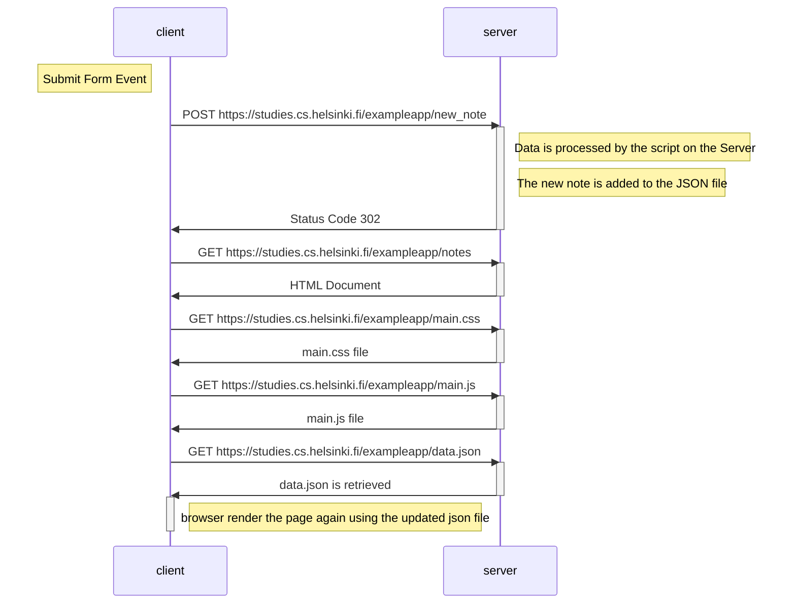

```mermaid
sequenceDiagram
    participant client
    participant server

    note left of client: Submit Form Event
    client->>server: POST https://studies.cs.helsinki.fi/exampleapp/new_note
    activate server
    note right of server: Data is processed by the script on the Server
        note right of server: The new note is added to the JSON file
    server->>client: Status Code 302
    deactivate server
    client->>server: GET https://studies.cs.helsinki.fi/exampleapp/notes
    activate server
    server->>client: HTML Document
    deactivate server
    client->>server: GET https://studies.cs.helsinki.fi/exampleapp/main.css
    activate server
    server->>client: main.css file
    deactivate server
    client->>server: GET https://studies.cs.helsinki.fi/exampleapp/main.js
    activate server
    server->>client: main.js file
    deactivate server
    client->>server: GET https://studies.cs.helsinki.fi/exampleapp/data.json
    activate server
    server->>client: data.json is retrieved
    deactivate server
    activate client
    note right of client: browser render the page again using the updated json file
    deactivate client
```
