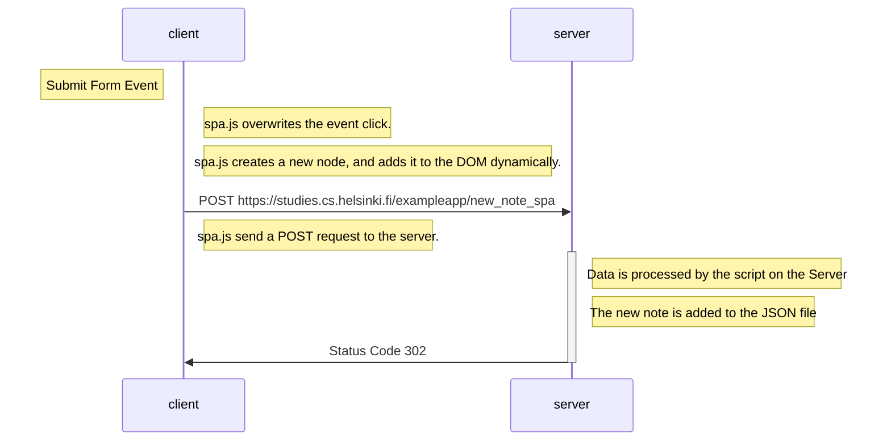

```mermaid
sequenceDiagram
    participant client
    participant server

    note left of client: Submit Form Event

    note right of client: spa.js overwrites the event click.

    note right of client: spa.js creates a new node, and adds it to the DOM dynamically.

    client->>server: POST https://studies.cs.helsinki.fi/exampleapp/new_note_spa

    note right of client: spa.js send a POST request to the server.

    activate server
    note right of server: Data is processed by the script on the Server
        note right of server: The new note is added to the JSON file
    server->>client: Status Code 302
    deactivate server
```
